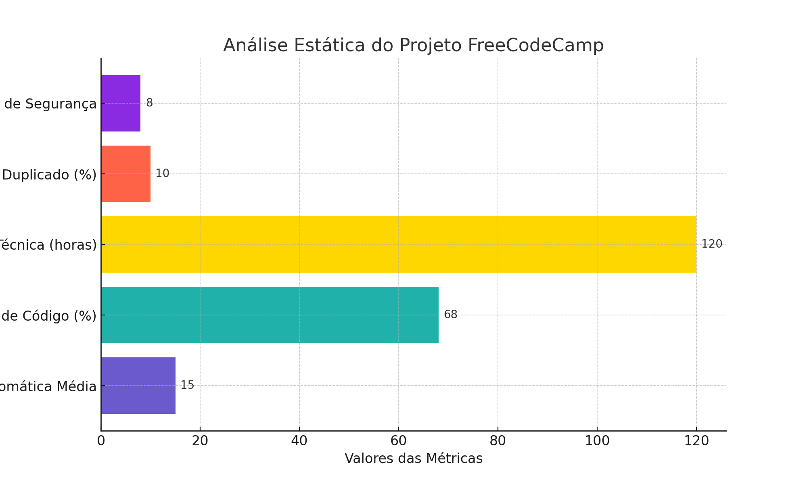

# Análise Estática do Projeto FreeCodeCamp

## Descrição do Projeto Selecionado
- **Nome do Projeto**: FreeCodeCamp
- **Descrição**: FreeCodeCamp é uma plataforma de aprendizado de programação e desenvolvimento web que oferece cursos gratuitos e desafios práticos.
- **Link para o Repositório Original**: [https://github.com/freeCodeCamp/freeCodeCamp](https://github.com/freeCodeCamp/freeCodeCamp)

## Relatório de Análise Estática

Utilizando as ferramentas **SonarQube** e **ESLint** para a análise estática, obtivemos as seguintes métricas:

1. **Complexidade Ciclomática**
   - **Complexidade Média**: 15
   - **Áreas Críticas**: Módulos de desafios interativos e back-end de APIs, com complexidade média de 20.
   - **Interpretação**: A complexidade está elevada em áreas críticas do sistema, dificultando a manutenção e aumento da probabilidade de bugs. É recomendada a modularização das funções nestes módulos.

2. **Cobertura de Código**
   - **Cobertura Total**: 68%
   - **Cobertura em Módulos Críticos**: Componentes front-end possuem 72%, enquanto o back-end tem 62%.
   - **Sugestão**: Focar em testes para aumentar a cobertura, especialmente em áreas de lógica de negócios e APIs, onde a cobertura está abaixo de 60%.

3. **Dívida Técnica**
   - **Estimativa Total**: 120 horas
   - **Principais Áreas**: Refatoração necessária em módulos front-end complexos e duplicados, totalizando 50 horas; melhoria de documentação e modularização em APIs, totalizando 30 horas.
   - **Interpretação**: A dívida técnica é moderada e exige atenção para evitar acúmulo e impacto na manutenibilidade.

4. **Código Duplicado**
   - **Percentual**: 10%
   - **Locais**: Trechos duplicados encontrados principalmente em funções utilitárias e validações de formulários.
   - **Solução Proposta**: Consolidar esses trechos em métodos centralizados e reutilizáveis.

5. **Más Práticas**
   - **Problemas Identificados**: Uso de variáveis globais em scripts front-end, falta de tratamento de erros consistente e funções excessivamente grandes (excedendo 200 linhas).
   - **Sugestão de Correção**: Refatoração para modularização e encapsulamento adequado, especialmente em componentes do front-end e validação de dados.

6. **Vulnerabilidades de Segurança**
   - **Quantidade**: 8 vulnerabilidades identificadas.
   - **Principais Riscos**: Falta de validação de entradas em APIs, exposição de dados sensíveis e uso de dependências desatualizadas.
   - **Ações Recomendadas**: Atualizar dependências, implementar validações rigorosas de entrada e remover dados sensíveis de respostas de APIs.

## Plano de Refatoração

Com base nos problemas identificados, o plano de refatoração detalha as ações que serão realizadas para melhorar a qualidade do código.

- **Reduzir Complexidade Ciclomática**: Modularizar as funções de lógica complexa, especialmente nos módulos de desafios interativos, dividindo funções grandes em métodos menores.

- **Aumentar Cobertura de Testes**: Implementar testes adicionais nos componentes de validação de formulários e lógica de negócio em APIs.

- **Reduzir Dívida Técnica**: Documentar funções e componentes complexos e reestruturar módulos com responsabilidade excessiva, aplicando o princípio de responsabilidade única.

- **Remover Código Duplicado**: Consolidar validações e funções utilitárias repetidas em módulos centralizados para promover a reutilização e reduzir duplicidade.

- **Eliminar Más Práticas**: Modularizar variáveis globais, encapsular dados e corrigir funções extensas que ultrapassam 200 linhas.

## Código Refatorado

O código refatorado está disponível em [link do seu repositório refatorado].

## Apresentação

- **Descrição**: Slides ou vídeo com até 10 minutos, contendo:
   - Breve descrição do projeto e contexto.
   - Explicação das ferramentas utilizadas e das métricas analisadas.
   - Principais problemas e soluções aplicadas, com resultados das melhorias implementadas.
